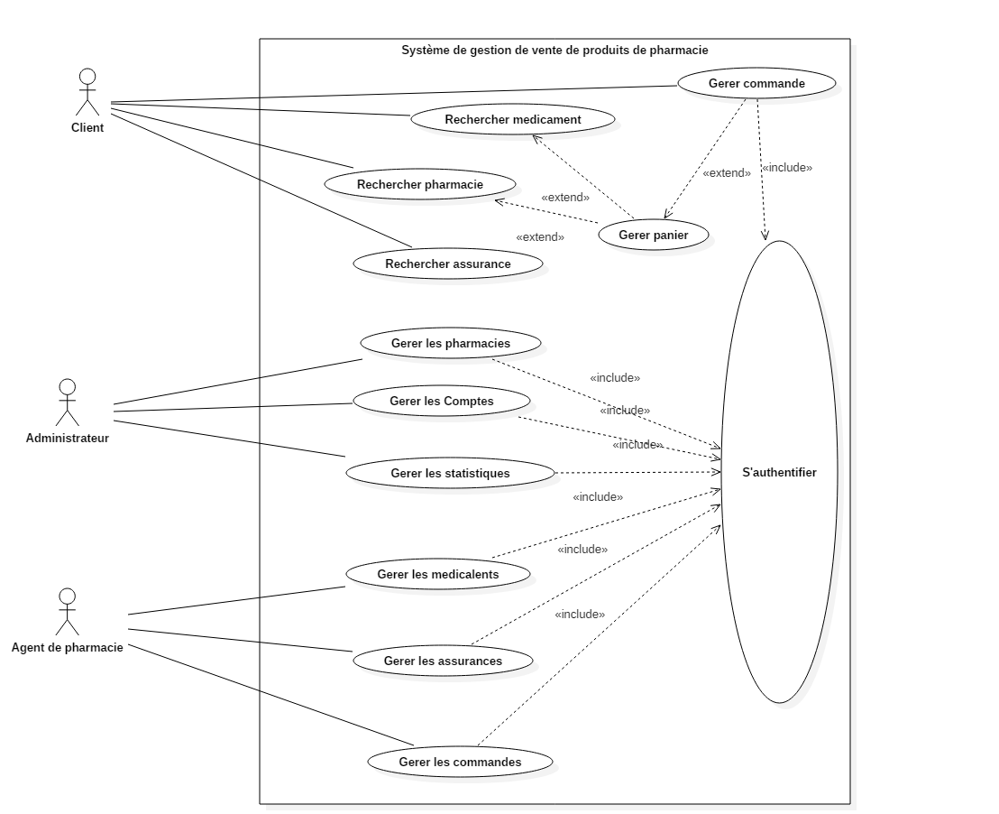
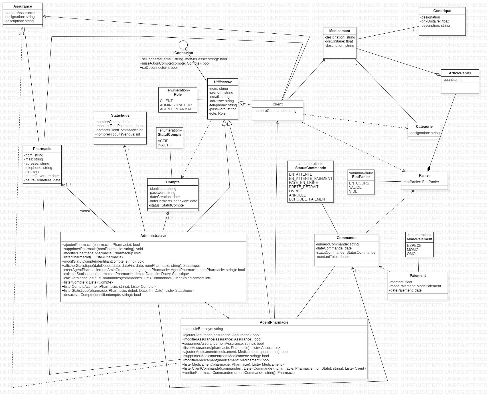
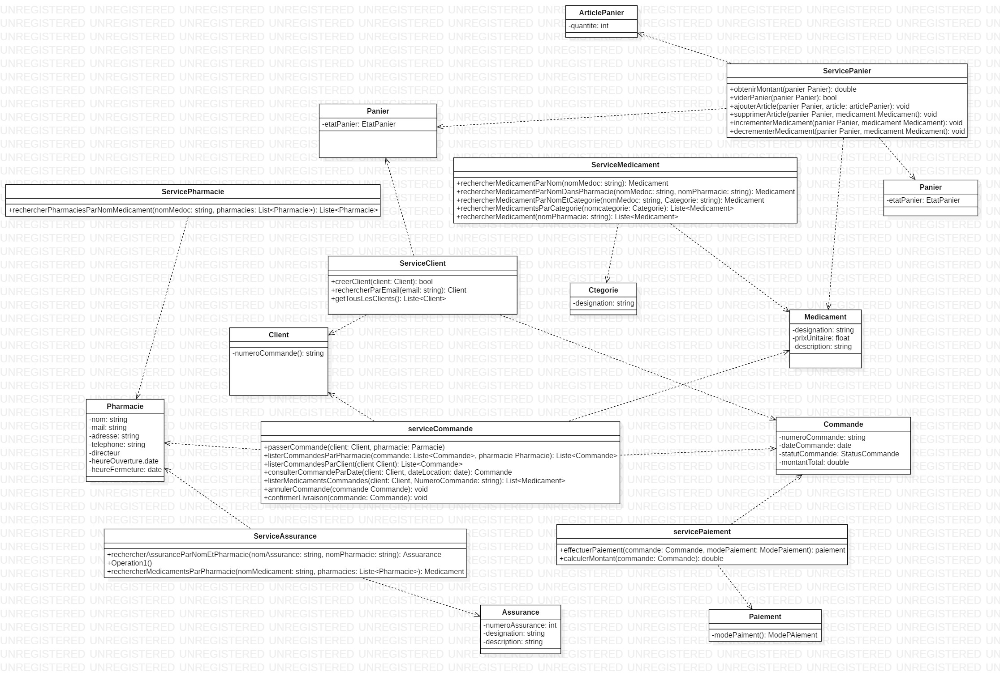
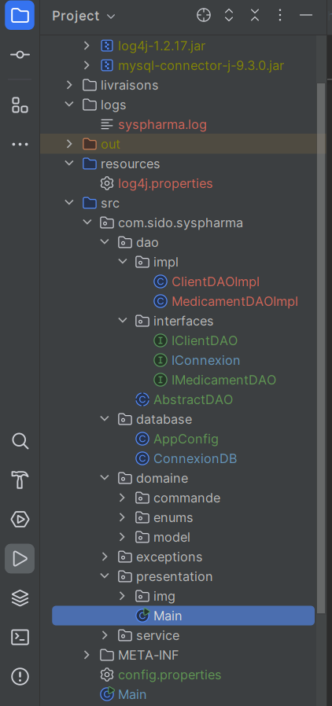

# 💊 SystPharma – Plateforme de gestion de pharmacie

**SystPharma** est une application Java orientée objet conçue pour faciliter la gestion d’une pharmacie moderne.  
Elle permet aux clients, agents de pharmacie et administrateurs d’interagir avec les différentes fonctionnalités autour des médicaments, des commandes, du panier, des assurances et des statistiques.

---

## 👥 Acteurs

- **Client** : recherche, commande, paie les médicaments.
- **Agent de pharmacie** : gère les médicaments, les assurances, les commandes.
- **Administrateur** : supervise l'ensemble des utilisateurs, pharmacies et statistiques.

## 🧾 Fonctionnalités (Version 3)

### 🔐 Authentification & Compte
- Connexion / déconnexion
- Création de compte client
- Mise à jour du compte
- Système de rôles : `ADMIN`, `CLIENT`, `AGENT_PHARMACIE`
- Statut du compte : `ACTIF`, `DESACTIVE`

---

### 🧪 Médicament & Assurance
- Rechercher un médicament :
  - Par nom
  - Par catégorie
  - Dans une pharmacie donnée
- Ajouter / modifier / supprimer un médicament (agent)
- Rechercher assurance par nom
- Ajouter / modifier / supprimer une assurance

---

### 🛒 Panier & Commande
- Ajouter / supprimer un article
- Incrémenter / décrémenter la quantité
- Vider le panier
- Calculer le montant total
- Passer une commande (avec pharmacie)
- Paiement par `ESPECE`, `MOMO`, etc.

---

### 📦 Statistiques
- Chiffre d’affaires sur une période
- Nombre de clients
- Médicaments les plus commandés
- Nombre total de produits vendus

---

## 🛠️ Outils & bonnes pratiques

- ✅ Architecture en 4 couches : `domaine`, `dao`, `service`, `presentation`
- ✅ Utilisation de `PreparedStatement` pour sécuriser les requêtes
- ✅ Factorisation de la connexion JDBC (via `ConnexionDB`)
- ✅ Externalisation de la config via `config.properties`
- ✅ Logging centralisé avec `log4j`
- ✅ Gestion personnalisée des exceptions via `DataBaseException`
- ✅ Utilisation de **Stream** et **Expression Lambda** (Java 8+)

---

---

## 📦 Modèle métier

Les principales entités du projet sont :

| Entité             | Attributs clés |
|--------------------|----------------|
| **Médicament**     | désignation, prix, description, catégorie, image |
| **Générique**      | désignation, prix, description, médicament original |
| **Catégorie**      | désignation |
| **Assurance**      | numéro unique, désignation, description |
| **Client**         | nom, prénom, email, adresse, téléphone, mot de passe, numéro de commande |
| **Agent pharmacie**| nom, prénom, matricule, email, adresse, téléphone, mot de passe |
| **Administrateur** | nom, prénom, email, adresse, téléphone, mot de passe |
| **Pharmacie**      | désignation, email, adresse, téléphone, directeur, horaires, stock, assurances |
| **Article Panier** | médicament, quantité, prix unitaire |
| **Panier**         | état (EN_COURS, VALIDE, VIDE), liste d'articles |
| **Commande**       | numéro, date, statut, client, pharmacie, panier |
| **Paiement**       | montant, mode de paiement, date |
| **Statistique**    | nombre de commandes, clients, chiffre d'affaires, produits vendus |

---

## 📊 Diagrammes

### 🧰 Use Case Diag

### 📘 Class Diagram

### 📘 Class Diagram découpage moderne (évolution avec classes services)

---

## 📁 Structure du projet

---

## ⚙️ Technologies utilisées

- Java 17
- JDBC avec **MySQL**
- Pattern DAO + Service
- Fichier `.properties` (I18N/config externe)
- Logging avec **Log4j 1.2.17**
- IntelliJ IDEA
- Git / GitHub

---

## 📈 État d’avancement

| Tâche                                  | Statut |
| -------------------------------------- | ------ |
| Architecture en couches                | ✅      |
| Connexion JDBC factorisée              | ✅      |
| Services spécialisés                   | ✅      |
| DAO avec interfaces et implémentations | ✅      |
| Gestion d’erreurs personnalisée        | ✅      |
| Logging Log4j                          | ✅      |
| Lambda / Stream Java 8+                | ✅      |
| Interface Console                      | ✅      |
| Interface Swing / Web                  | ⏳      |
| Maven / Automatisation                 | 🔜     |

---

## 📂 Fichiers importants
- /config.properties → contient la configuration BD
- /logs/syspharma.log → contient tous les logs (info, erreur)
- /lib/ → contient le driver MySQL et log4j
- /presentation/Main.java → point d’entrée console (temporaire)
- Main.java

---

## 🔐 Sécurité

- Requêtes paramétrées (PreparedStatement)
- Fichier config hors code
- Logger pour tracer les anomalies
- Pas d’information sensible en dur dans le code source

---

## 👩‍💻 Auteur

Ce projet a été réalisé dans le cadre du TP Java Orienté Objet + JDBC (Objis).
Guidé par les bonnes pratiques professionnelles et pédagogiques.
(Février 2024–2025)
- Linkedin: www.linkedin.com/in/sidonie-djuissi-fohouo
- Email: sidoniedjuissifohouo@gmail.com
- Tel: +237 696 00 23 77
- Dernière mise à jour 23/05/2025
