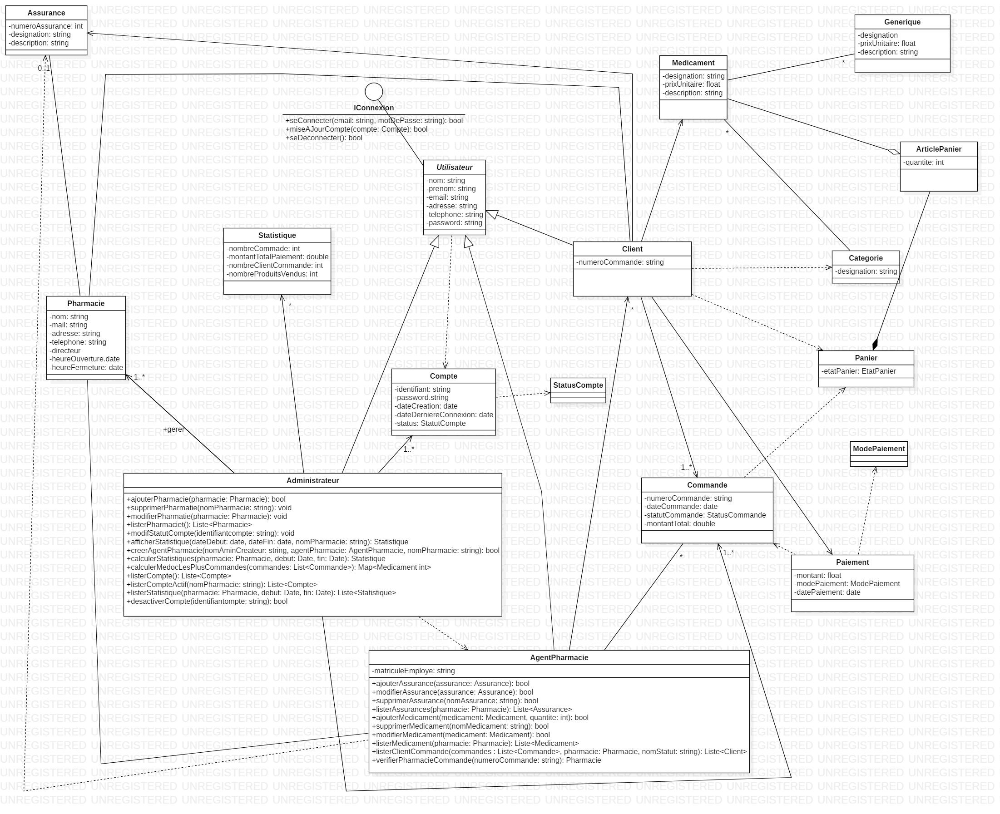
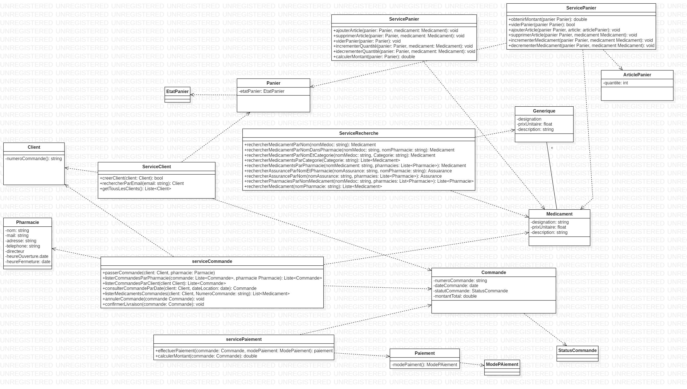
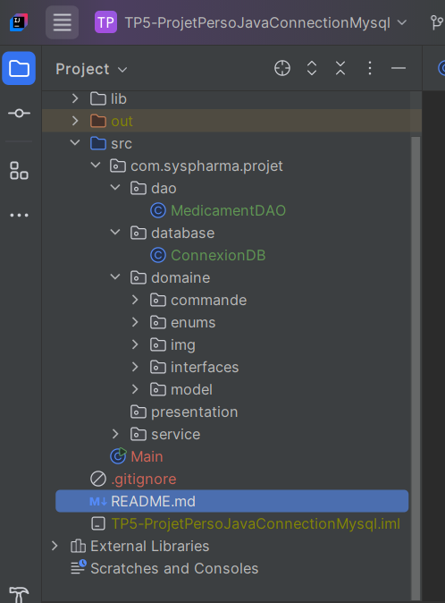

# 💊 SystPharma – Plateforme de gestion de pharmacie

**SystPharma** est une application Java orientée objet conçue pour faciliter la gestion d’une pharmacie moderne.  
Elle permet aux clients, agents de pharmacie et administrateurs d’interagir avec les différentes fonctionnalités autour des médicaments, des commandes, du panier, des assurances et des statistiques.

---

## 👥 Acteurs

- **Client** : Recherche, commande et paie les médicaments.
- **Agent de pharmacie** : Gère les médicaments, les assurances et les commandes.
- **Administrateur** : Supervise les pharmacies, les utilisateurs et les statistiques.

---

## 🧾 Fonctionnalités (Version 3)

### 🔐 Utilisateurs authentifiés :
- Connexion / déconnexion
- Mise à jour du compte
- Rechercher un médicament (par nom, par catégorie, ou dans une pharmacie donnée)
- Rechercher une assurance ou celles prises en charge par une pharmacie
- Gérer un panier :
  - Ajouter un article
  - Supprimer un article
  - Vider le panier
  - Obtenir le montant total

---

### 👤 Spécifiquement pour les **clients** :
- Créer un compte
- Passer une commande de médicaments dans une pharmacie
- Consulter une commande à une date donnée
- Obtenir un récapitulatif de commande (montant + articles)
- Effectuer le paiement (Espèce ou en ligne)

---

### 🧑‍⚕️ Spécifiquement pour les **agents de pharmacie** :
- Ajouter, modifier, supprimer et lister les médicaments
- Ajouter, modifier, supprimer et lister les assurances
- Lister les commandes
- Confirmer la livraison après paiement ou retrait
- Lister les clients ayant commandé dans une pharmacie (par statut)
- Vérifier la pharmacie associée à une commande

---

### 🛠️ Spécifiquement pour les **administrateurs** :
- Ajouter, modifier, supprimer et lister les pharmacies
- Créer un compte pour un agent de pharmacie
- Gérer les comptes utilisateur (client / agent)
- Modifier le statut d’un compte (actif, désactivé, etc.)
- Lister toutes les commandes d’une pharmacie
- Afficher les statistiques globales ou par pharmacie
- Lister les médicaments les plus commandés

---

## 📦 Modèle métier

Les principales entités du projet sont :

| Entité             | Attributs clés |
|--------------------|----------------|
| **Médicament**     | désignation, prix, description, catégorie, image |
| **Générique**      | désignation, prix, description, médicament original |
| **Catégorie**      | désignation |
| **Assurance**      | numéro unique, désignation, description |
| **Client**         | nom, prénom, email, adresse, téléphone, mot de passe, numéro de commande |
| **Agent pharmacie**| nom, prénom, matricule, email, adresse, téléphone, mot de passe |
| **Administrateur** | nom, prénom, email, adresse, téléphone, mot de passe |
| **Pharmacie**      | désignation, email, adresse, téléphone, directeur, horaires, stock, assurances |
| **Article Panier** | médicament, quantité, prix unitaire |
| **Panier**         | état (EN_COURS, VALIDE, VIDE), liste d'articles |
| **Commande**       | numéro, date, statut, client, pharmacie, panier |
| **Paiement**       | montant, mode de paiement, date |
| **Statistique**    | nombre de commandes, clients, chiffre d'affaires, produits vendus |

---

## 📊 Diagrammes

### 🧰 Use Case Diag

### 📘 Class Diagram

### 📘 Class Diagram découpage moderne (évolution avec classes services)

---

## 📁 Structure du projet

---

## 🚀 Technologies utilisées

- Java (POO + Collections : `List`, `Set`, `Map`)
- IntelliJ IDEA
- Git & GitHub
- MySQL (préparation couche DAO)

---

## 📈 État d’avancement

- [x] Modélisation UML
- [x] Classes métier et héritage
- [x] Interfaces & services
- [x] Gestion des comptes
- [x] Gestion du panier et des commandes
- [x] DAO & Connexion MySQL (préparée)
- [ ] Interface graphique (JavaFX / Web)

---

 Projet SystPharma (TP Java Orienté Objet + Accès Base de Données)

## 👩‍💻 Auteur

- Sidonie — Apprenante Fullstack Java, Objis (Février 2024–2025)
- Linkedin: www.linkedin.com/in/sidonie-djuissi-fohouo
- Email: sidoniedjuissifohouo@gmail.com
- Tel: +237 696 00 23 77
- Dernière mise à jour 16/05/2025
